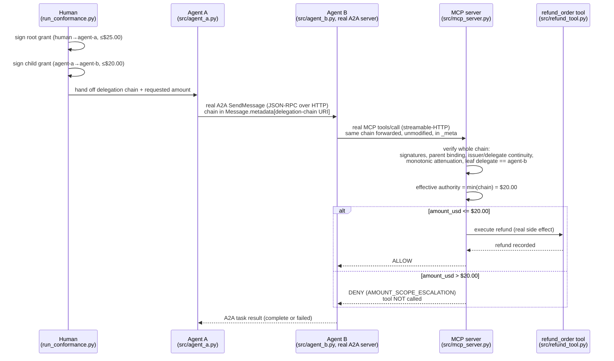

# A2A → MCP Delegated-Authority Conformance Fixture

A single, small, executable conformance scenario. It checks whether a
**narrowed delegated authority** survives a real, multi-hop
agent-to-agent-to-tool composition:

```text
Human  →  Agent A  →  A2A  →  Agent B  →  MCP  →  refund_order tool
```

using the **official A2A and MCP SDKs** over real network sockets — not
handwritten HTTP/JSON-RPC shims.

> **This is a conformance test, not a framework, not a new protocol, and
> not a standardization proposal.** It does not claim the underlying
> security idea is novel — it is not (see [PRIOR_ART.md](PRIOR_ART.md)).
> It exists to answer one narrow, practical question: *can this
> already-known security pattern be threaded correctly through the
> official SDKs of two specific, currently popular AI-agent protocols?*

## Table of contents

- [The scenario](#the-scenario-refund-cap-must-survive-a2a--mcp)
- [Threat model](#threat-model)
- [Protocol-defined vs. fixture-local behavior](#protocol-defined-behavior-vs-fixture-local-behavior)
- [SDKs used](#sdks-used-exact-versions)
- [Architecture](#architecture)
- [Repository layout](#repository-layout)
- [How to run](#how-to-run-from-a-clean-checkout)
- [Enforcement rule](#enforcement-rule-srcauthoritypy)
- [Expected output](#expected-output)
- [CI](#ci)
- [Deviations and known limitations](#deviations-from-the-originally-sketched-layout)
- [Prior art and non-novelty disclaimer](#prior-art-and-non-novelty-disclaimer)

## The scenario: "Refund Cap Must Survive A2A → MCP"

```text
Human authorizes Agent A:      refund order O-1001, max $25.00
Agent A delegates to Agent B:  refund order O-1001, max $20.00
Effective Agent B authority:   min($25.00, $20.00) = $20.00
```

| Attempt | Amount | Against human root ($25) | Against delegated authority ($20) | Decision |
|---|---|---|---|---|
| Valid   | $18.00 | within  | within  | **ALLOW** — tool executes exactly once |
| Invalid | $22.00 | within  | **exceeds** | **DENY** — tool must not execute |

The invalid case is deliberately designed so that `$22 <= $25` is true. A
broken implementation that checks only the human root grant would
incorrectly allow it. The correct effective authority is the **intersection
across the whole delegation chain**, not just its root or just its leaf.

## Threat model

**What this fixture tests for:**

- **Intermediate-authority re-expansion.** Agent B (or a compromised/buggy
  component between Agent A and the tool) attempts to execute an action
  that is within the authority the *human* originally granted, but
  outside the *narrower* authority Agent A actually delegated to Agent B.
  This is the specific failure class under test — not generic missing
  authentication, not a missing authorization check, but the **silent
  loss or re-expansion of an intermediate attenuation step** in a
  multi-hop chain.
- **Cross-protocol metadata loss or mutation.** Whether the delegation
  evidence itself survives, unmodified, a real hop from one wire protocol
  (A2A) into a different one (MCP) — including a subtle, real
  serialization effect this fixture discovered and now regression-tests
  (see [Enforcement rule](#enforcement-rule-srcauthoritypy) and
  [Deviations](#deviations-from-the-originally-sketched-layout)).
- **Detectability of the failure mode.** Whether a test harness built
  around this scenario can actually distinguish a correct implementation
  from a broken one — verified via the intentionally vulnerable
  `--simulate-vulnerable` mode, which must be caught and flagged as
  non-conformant.

**What this fixture explicitly does NOT test for, and is not a defense
against:**

- Network-level attacks (the servers run on unauthenticated loopback
  HTTP for the fixture's duration; there is no TLS, no mutual
  authentication between hops, and no protection against a
  man-in-the-middle on the loopback interface itself).
- Prompt injection or any LLM-reasoning-layer compromise of Agent A or
  Agent B's decision to delegate in the first place. This fixture assumes
  Agent A faithfully signs the child grant it intends to issue; it does
  not model an LLM being tricked into issuing a wider child grant than
  intended.
- Replay attacks. The signed grants have no nonce, timestamp validity
  window, or single-use enforcement beyond the fixture's `max_uses`
  field, which is declared but not independently tracked/consumed across
  multiple runs.
- Revocation. There is no mechanism to invalidate a previously issued
  grant.
- Key management, key rotation, or any production trust model. Signing is
  a single static HMAC key read from an environment variable or a
  hard-coded default — explicitly a test integrity primitive, not
  production cryptography.
- Confidentiality of the delegation chain in transit (beyond whatever
  transport security the deployment adds — none is configured here).
- Denial of service, resource exhaustion, or availability properties of
  either SDK's transport implementation.

This narrow scope is intentional. Broadening the threat model would
require broadening the implementation, which is out of scope for a
conformance fixture whose only job is to check one specific security
property end to end.

## Protocol-defined behavior vs. fixture-local behavior

This distinction matters and is enforced throughout the code:

**Protocol-defined** (real A2A / MCP semantics, used as-is):
- A2A: `AgentCard`, `AgentExecutor`, `SendMessageRequest`/`Message`,
  `contextId`/`taskId`, the JSON-RPC transport, and the generic
  `AgentExtension` / `Message.metadata` mechanism.
- MCP: `ClientSession`, the streamable-HTTP transport, `tools/call`, tool
  registration, and the generic per-request `_meta` object.

**Fixture-local** (this repo's own test scaffolding, NOT part of either
protocol):
- The delegation-chain JSON schema (`grant`, `signature`, `algorithm`;
  `issuer`, `delegate`, `parent`, `action`, `resource`, `max_amount_usd`,
  `max_uses`).
- The HMAC-SHA256 signing method (a deterministic test integrity primitive
  — **not production cryptography**: no asymmetric keys, no key management,
  no revocation, no replay protection).
- The attenuation rule (each link may only narrow, never widen, its
  parent's authority) and the effective-authority algorithm
  (`min()` across the whole chain).
- The two carrier keys used to place the chain on the wire:
  - A2A: `https://example.org/a2a/extensions/delegation-chain/v1`, an
    `AgentExtension` URI, with the payload under
    `Message.metadata[<that URI>]`.
  - MCP: `io.example.a2a-mcp-conformance/delegation-chain`, a namespaced
    key under `CallToolRequestParams._meta`.

**This repository does not claim that A2A or MCP standardize this
delegation representation.** It tests whether an implementation *built on
top of* their existing, protocol-legal extension/metadata mechanisms can
preserve and enforce a narrowed delegated authority across both boundaries.

**This fixture tests whether narrowed delegated authority can be preserved
and enforced across A2A and MCP protocol boundaries.**

For a full accounting of what related work already exists in this space —
A2A and MCP's own delegation-related proposals, OAuth Token Exchange,
GNAP, Macaroons, Biscuit tokens, UCAN, ZCAP-LD, and current AI-agent
authorization research — see [PRIOR_ART.md](PRIOR_ART.md).

## SDKs used (exact versions)

Installed and verified against, from a clean virtualenv on Python 3.11:

| Package | Version | Role |
|---|---|---|
| [`a2a-sdk`](https://pypi.org/project/a2a-sdk/) | **1.1.2** | Official A2A SDK — client (`a2a.client`) and server (`a2a.server`) |
| [`mcp`](https://pypi.org/project/mcp/) | **2.1.1** | Official MCP SDK — client (`mcp.client`) and server (`mcp.server.mcpserver`) |
| `httpx` | 0.28.1 | HTTP transport for the A2A client |
| `uvicorn` | 0.52.4 | ASGI server hosting Agent B's A2A endpoint |
| `starlette` | 1.6.0 | Routing for Agent B's A2A endpoint (via `a2a-sdk`'s route builders) |

`pyproject.toml` declares `a2a-sdk>=1.1.2,<2` and `mcp>=2.1.1,<3`; these
exact pinned versions are the ones verified in
[VERIFICATION_RESULTS.md](VERIFICATION_RESULTS.md).

The A2A and MCP wire-protocol versions actually negotiated at runtime are
read from the SDKs at runtime (not hard-coded) and reported in every run's
JSON result under `protocols.a2a_wire_protocol` / `protocols.mcp_wire_protocol`
— observed as `1.0` and `2026-07-28` respectively with the pinned SDK
versions above. `a2a-sdk` 1.x represents A2A messages as protobuf-generated
Python types (`a2a.types`, backed by `a2a_pb2`); this fixture uses that
representation directly rather than the legacy JSON-only 0.x surface.

## Architecture



Every arrow above is a real network call over a real socket (HTTP/1.1,
loopback) driven by the official SDK on both ends — `run_conformance.py`
starts the MCP server and Agent B's A2A server as subprocesses bound to
free ports, then drives Agent A as a client against Agent B. The only
non-network calls in the runtime path are internal policy/helper
functions inside `src/authority.py` — they are not substitutes for either
protocol boundary.

## Repository layout

```text
a2a-mcp-authority-conformance/
├── README.md
├── LICENSE
├── PRIOR_ART.md
├── VERIFICATION_RESULTS.md
├── pyproject.toml
├── src/
│   ├── authority.py      # fixture-local delegation-chain model + PEP (protocol-agnostic)
│   ├── constants.py       # namespaced metadata keys (fixture-local)
│   ├── agent_a.py         # real A2A client: issues chain, sends A2A message
│   ├── agent_b.py         # real A2A server + real MCP client
│   ├── mcp_server.py       # real MCP server exposing refund_order
│   └── refund_tool.py      # the tool-side side-effect ledger
├── tests/
│   ├── test_authority.py    # unit tests for the policy-enforcement logic
│   └── test_conformance.py  # end-to-end test driving the real server processes
├── run_conformance.py       # orchestrates the full scenario, emits JSON result
└── .github/workflows/conformance.yml
```

## How to run (from a clean checkout)

```bash
git clone <this-repository-url>
cd a2a-mcp-authority-conformance
python3 -m venv .venv
source .venv/bin/activate
pip install -e ".[test]"

# unit + end-to-end tests
python -m pytest tests/ -v

# secure implementation
python run_conformance.py
# -> exit 0, prints "CONFORMANCE PASS"

# vulnerability detector: intentionally-broken variant that checks
# only the human root grant and ignores the agent-a -> agent-b attenuation
python run_conformance.py --simulate-vulnerable
# -> exit 1 (non-zero), prints "VULNERABILITY DETECTED"
```

Both commands write a machine-readable result to `traces/result.json`
(path configurable via `--output`), for example:

```json
{
  "scenario": "refund-cap-survives-a2a-mcp",
  "protocols": {
    "a2a": "1.1.2",
    "a2a_wire_protocol": "1.0",
    "mcp": "2.1.1",
    "mcp_wire_protocol": "2026-07-28"
  },
  "human_limit": 25.0,
  "delegated_limit": 20.0,
  "valid_attempt": 18.0,
  "invalid_attempt": 22.0,
  "valid_decision": "allow",
  "invalid_decision": "deny",
  "invalid_tool_side_effects": 0,
  "result": "pass"
}
```

No external services, credentials, or network access beyond loopback are
required. Both servers bind to dynamically allocated free ports on
`127.0.0.1` and are torn down automatically at the end of each run.

## Enforcement rule (src/authority.py)

The MCP-side policy enforcement point (`assert_request_is_within_authority`)
verifies, for every request:

- valid HMAC signature on every link in the chain
- correct parent binding (`child.parent == hash(parent.grant)`)
- correct issuer/delegate chain (`child.issuer == parent.delegate`)
- correct action and resource, unchanged across every link
- non-increasing `max_amount_usd` at every hop
- non-increasing `max_uses` at every hop
- leaf delegate equals the expected caller (`agent-b`)
- `requested amount <= effective authority`, where effective authority is
  `min()` over every link's `max_amount_usd` — **not** the leaf's claim and
  **not** the root's ceiling alone.

`assert_request_is_within_authority_vulnerable` is the intentionally broken
counterpart used only by `--simulate-vulnerable`: it verifies only the
human root grant and never consults the agent-a → agent-b delegation at
all, so a widened downstream request that still fits under the root limit
is (incorrectly) allowed. It exists solely to demonstrate that the negative
test in `run_conformance.py` can actually detect this class of bug.

`assert_request_is_within_authority_truncation_vulnerable` is a **second**,
distinct broken counterpart used only by `--simulate-vulnerable-truncation`.
The two vulnerable modes model different bugs and must not be conflated:

| Vulnerable mode | Evidence received | Bug |
| --- | --- | --- |
| `--simulate-vulnerable` | complete chain (`$25` → `$20`) | saw the `$20` hop, ignored its attenuation |
| `--simulate-vulnerable-truncation` | truncated chain (`$25` only) | never saw the `$20` hop, failed to notice the chain does not reach the requester |

## Security properties covered

| # | Property | Presented chain | Requester | Amount | Expected |
| --- | --- | --- | --- | --- | --- |
| 1 | Normal success | `$25` → `$20` (complete) | agent-b | `$18` | **ALLOW**, tool executes |
| 2 | Attenuation enforcement | `$25` → `$20` (complete) | agent-b | `$22` | **DENY** `AMOUNT_SCOPE_ESCALATION` |
| 3 | Chain-truncation resistance | `$25` only (`agent-a → agent-b` omitted) | agent-b | `$22` | **DENY** `LEAF_DELEGATE_MISMATCH` |
| 4 | Truncation control | `$25` only (`agent-a → agent-b` omitted) | agent-b | `$18` | **DENY** `LEAF_DELEGATE_MISMATCH` |

Properties 2 and 3 are deliberately **different failure modes and different
error codes**, and the fixture asserts they stay distinguishable:

- In (2) the chain is *complete*. Every hop is present; the request simply
  asks for more than the narrowest hop granted. The failure is attenuation.
- In (3) the chain is *incomplete*. Every credential presented is
  individually valid and correctly signed — but the chain terminates at
  `agent-a`, and the expected requester is `agent-b`. The failure is that the
  presented evidence never delegated anything to the requester.

A verifier must not treat "all presented credentials are valid" as
equivalent to "the requester holds a complete valid delegation path."
Truncating a restrictive downstream hop must not restore the authority
available to an upstream principal.

Property (4) is the control that makes (3) meaningful. `$18` is within
*both* the human `$25` and the delegated `$20`, so no amount check could
reject it — yet it is still denied, because the presented chain does not
reach `agent-b`. This proves requester/chain binding is enforced
**independently of** amount attenuation, rather than being an accidental
side effect of the ceiling comparison.

### Limitation: how the requester identity is established

The truncation defense depends on a trustworthy binding between the actual
caller and the `expected_leaf_delegate` value supplied to the terminal
authorization check. **In this fixture that binding is fixture-local and
configured** — `expected_leaf_delegate` defaults to `"agent-b"` in
`assert_request_is_within_authority`; it is *not* derived from an
authenticated MCP transport or session identity, and this fixture does not
authenticate the caller at all.

A production deployment must derive that value from the authenticated
session/principal rather than from caller-controlled evidence. If the
requester identity were itself attacker-supplied, this check would provide
no protection: an attacker who can claim to be `agent-a` can present a chain
terminating at `agent-a`. The property demonstrated here is *"a chain that
does not reach the expected requester is refused"*, not *"the requester is
who they say they are."*

### The re-expansion this prevents

If a terminal verifier accepts the valid `human-approval → agent-a` prefix
as sufficient authority for `agent-b`, then `$22` becomes allowed even
though `agent-b`'s real delegated ceiling was `$20`. Omitting the
restrictive hop silently re-expands effective authority from `$20` back to
the human root's `$25`. `--simulate-vulnerable-truncation` executes exactly
that path and the tool really does run, which is what makes the secure
mode's `LEAF_DELEGATE_MISMATCH` denial load-bearing rather than incidental.

Signing is a deterministic HMAC-SHA256 over canonical JSON. **This is a test
integrity primitive, not a production trust model.** A production system
would need real asymmetric signatures, key management, revocation, and
replay protection — none of which this fixture provides or claims to
provide (see [Threat model](#threat-model)).

## Expected output

### Secure implementation — `python run_conformance.py`

```text
[valid $18 attempt]   decision=allow reply='{"decision": "allow", "effective_authority_usd": "20.00", "refund": {"order_id": "O-1001", "amount_usd": "18.00", "refund_id": "refund-001"}}'
[invalid $22 attempt] decision=deny  reply='Error executing tool refund_order: DENY: requested amount_usd 22.00 exceeds effective delegated authority 20.00 (root=25.00, leaf=20.00) (AMOUNT_SCOPE_ESCALATION)'

CONFORMANCE PASS
  valid:   $18.00 <= delegated $20.00 -> ALLOW, tool executed
  invalid: $22.00 <= human root $25.00 but > delegated $20.00 -> DENY, tool NOT executed
```

Exit code: `0`.

### Vulnerable mode — `python run_conformance.py --simulate-vulnerable`

```text
[valid $18 attempt]   decision=allow reply='{"decision": "allow", "effective_authority_usd": "25.00", ...}'
[invalid $22 attempt] decision=allow reply='{"decision": "allow", "effective_authority_usd": "25.00", "refund": {"order_id": "O-1001", "amount_usd": "22.00", "refund_id": "refund-002"}}'

VULNERABILITY DETECTED: $22 request was allowed while only checking the $25 human root grant.
This is the expected outcome for --simulate-vulnerable: it proves the negative test can catch it.
```

Exit code: `1`.

A technically competent reviewer can confirm both outputs by running the
two commands above from a clean checkout; both are also asserted
programmatically in `tests/test_conformance.py` and re-verified in
[VERIFICATION_RESULTS.md](VERIFICATION_RESULTS.md).

## CI

`.github/workflows/conformance.yml` runs on every push/PR across Python
3.11–3.13 and asserts:

1. `python -m pytest tests/ -v` passes (unit tests for the authority model
   plus an end-to-end test that drives the real server processes).
2. `python run_conformance.py` exits `0` with `CONFORMANCE PASS`.
3. `python run_conformance.py --simulate-vulnerable` exits non-zero — CI
   fails if the vulnerable variant is incorrectly accepted as passing.
4. `python run_conformance.py --simulate-vulnerable-truncation` exits
   non-zero — CI fails if the chain-truncation variant (which accepts a
   valid upstream prefix as the requester's authority) is incorrectly
   accepted as passing.

The CI job as a whole passes only when the secure implementation passes
**and** the intentionally vulnerable implementation is correctly detected
as non-conformant.

## Deviations from the originally sketched layout

- `a2a-sdk` 1.x represents protocol messages as protobuf-generated types
  rather than plain JSON dicts. `SendMessageConfiguration`,
  `AgentCapabilities.extensions`, etc. are all protobuf messages. This
  fixture uses them directly (no re-wrapping) — see the comment in
  `src/authority.py` explaining why every signed grant scalar is a JSON
  *string*: `Message.metadata` is a `google.protobuf.Struct`, whose only
  numeric type is `double`, so a bare JSON integer would silently become
  `1.0` after crossing the real A2A hop and invalidate its own HMAC
  signature. This is a real, observed protocol-boundary effect, not a
  workaround for a fixture bug, and it is now covered by a dedicated
  regression test (`tests/test_authority.py::test_signature_survives_a_real_protobuf_struct_round_trip`).
- Agent B is implemented as a single-turn `AgentExecutor` that completes
  the task in one `execute()` call (no multi-turn / `input-required` flow),
  since the scenario itself is a single request-response per attempt.
- The MCP server surfaces authority denials via `mcp.server.mcpserver.server.ToolError`,
  which the SDK converts into a clean `isError: true` `CallToolResult`
  rather than a raw exception traceback reaching the client.

## Known limitations

- HMAC-SHA256 signing is a test-only integrity primitive; there is no key
  rotation, revocation, or replay protection. See [Threat model](#threat-model)
  for the full list of what this fixture is not a defense against.
- The MCP and A2A servers run as local subprocesses on loopback for the
  duration of one conformance run; this is a fixture harness, not a
  deployable service.
- Only the two scenario amounts ($18 valid, $22 invalid) are exercised by
  the end-to-end path; broader boundary/fuzz coverage of the authority
  model lives in `tests/test_authority.py` as fast, non-networked unit
  tests.

## Prior art and non-novelty disclaimer

The security property this fixture demonstrates — monotonic delegated-
authority attenuation enforced against the intersection of a whole
delegation chain — is prior art dating to at least 2014 (Macaroons), with
modern, more capable descendants (Biscuit tokens, ZCAP-LD, UCAN). **This
repository does not claim to have invented, discovered, or improved on
that security property.** It also does not propose a new A2A extension
standard, a new MCP standard, or any specification, and does not claim to
be first at anything. What may be defensibly said is narrower: as of the
review recorded in [PRIOR_ART.md](PRIOR_ART.md), no publicly verified,
runnable repository was found that carries this exact, already-known
security pattern across the *official* A2A and MCP SDKs specifically,
with a working positive/negative conformance pair. Read
[PRIOR_ART.md](PRIOR_ART.md) in full before citing, forking, or building
on this repository for anything beyond what it actually demonstrates.
